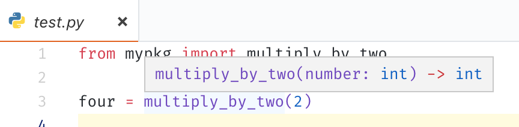
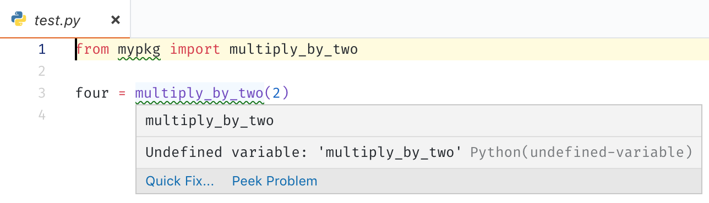

# vscode-1013-repro

[Issue #1013](https://github.com/Microsoft/python-language-server/issues/1013)

## Steps to reproduce:

1. Clone this repository
2. `cd vscode-1013-repro`
3. Create the virtualenv: `python3 -m venv .venv`
4. Open the directory in VS Code. `.vscode/settings.json` should load automatically with `python.autoComplete.extraPaths` and `python.pythonPath` set.
5. Open `test.py` and observe that the autocompletion works properly:
    
6. Inside the virtualenv, install package in editable mode: `source .venv/bin/activate && pip3 install -e .`
7. Reload the window (`Developer: Reload Window` in command palette)
8. Open `test.py` and observe that the PLS now produces import errors:
    